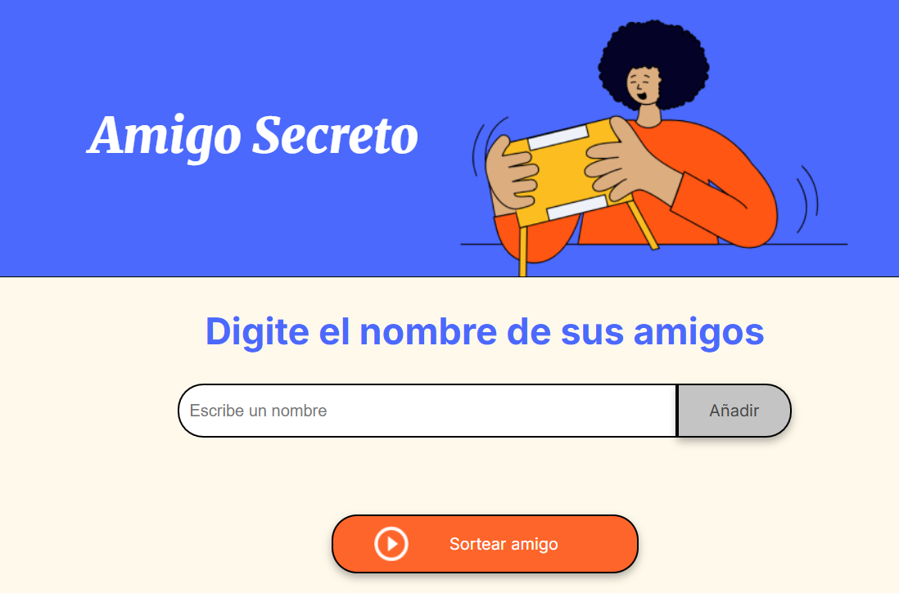

# Challenge amigo secreto

Mi actividad de One sobre el challenge de amigo secreto

# Sorteo de Amigos 🎉  

Este proyecto es una aplicación sencilla en JavaScript que permite agregar nombres a una lista y luego sortear aleatoriamente uno de ellos. Es ideal para practicar lógica de programación y manipulación del DOM.  

## 📌 Características  

- Agregar nombres de amigos a una lista interactiva.  
- Visualizar en pantalla la lista actualizada de nombres.  
- Realizar un sorteo aleatorio entre los nombres ingresados.  
- Validaciones para evitar entradas vacías.  

## 🚀 Tecnologías Utilizadas  

- **HTML** para la estructura de la interfaz.  
- **CSS** (opcional) para mejorar la apariencia visual.  
- **JavaScript** para la lógica del sorteo y la manipulación del DOM.  

## 🎯 Cómo Usarlo  

1. Escribe el nombre de un amigo en el campo de entrada.  
2. Haz clic en el botón **"Agregar Amigo"** para incluirlo en la lista.  
3. Una vez que hayas agregado todos los nombres, presiona **"Sortear Amigo"**.  
4. Se mostrará en pantalla el nombre del amigo seleccionado aleatoriamente.  

